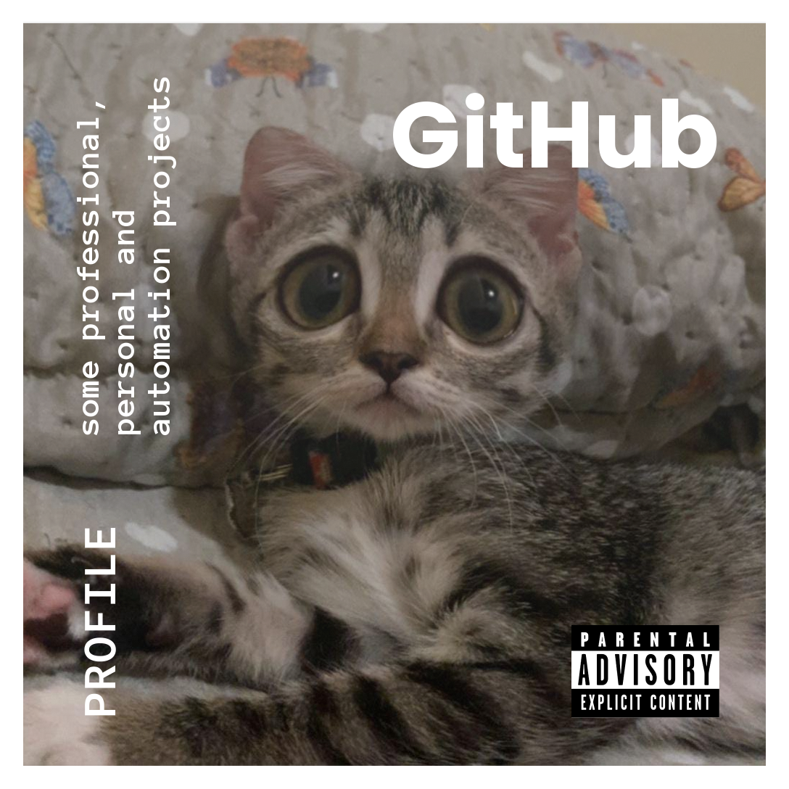

# 👋 Olá, eu sou o Keven

## 💻 Sobre mim

Sou um entusiasta do desenvolvimento de sistemas distribuídos, com foco em arquiteturas escaláveis e tecnologias modernas. Tenho experiência com diversas tecnologias e, atualmente, estou aprofundando meus conhecimentos em Ruby on Rails, Java e Vue.js.\
\
📌 Sempre em busca de novos desafios e aprendizados!

  

## 🚀 Onde me encontrar

🔗 Veja mais sobre mim no [meu portfólio](https://kevendasilva.github.io/portfolio/).\
✍️ Escrevo sobre minhas descobertas e projetos no meu [blog](https://kevendasilva.github.io/blog/).\
📫 Entre em contato comigo pelo [LinkedIn](http://www.linkedin.com/in/keven-da-silva-gonçalves).
